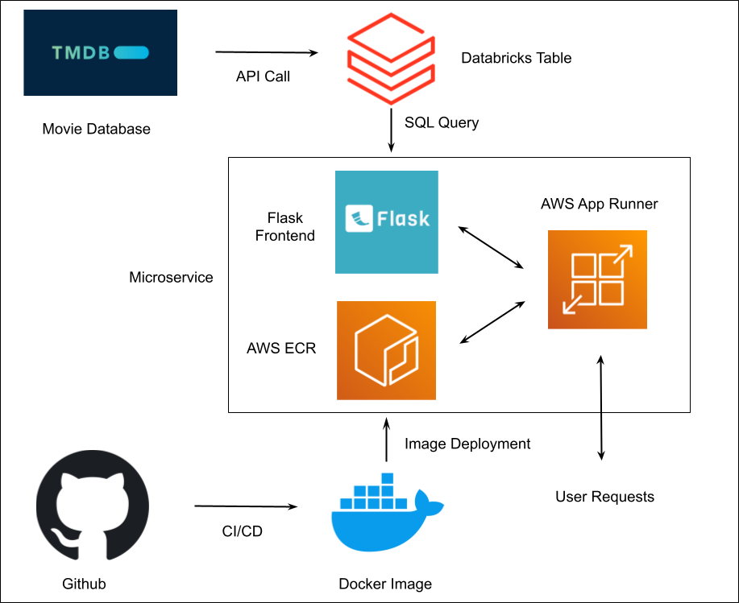
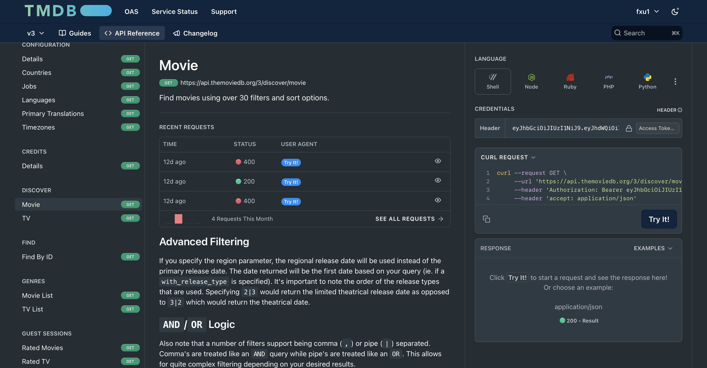
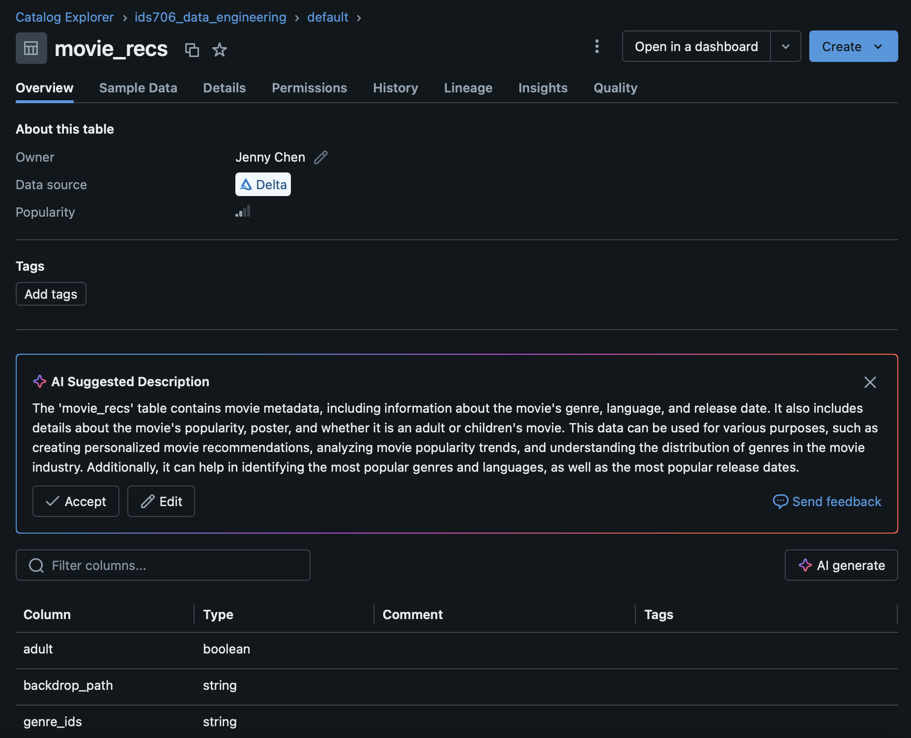
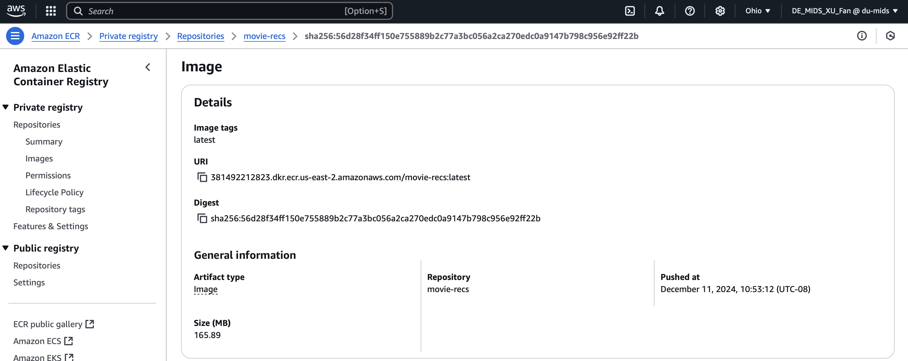
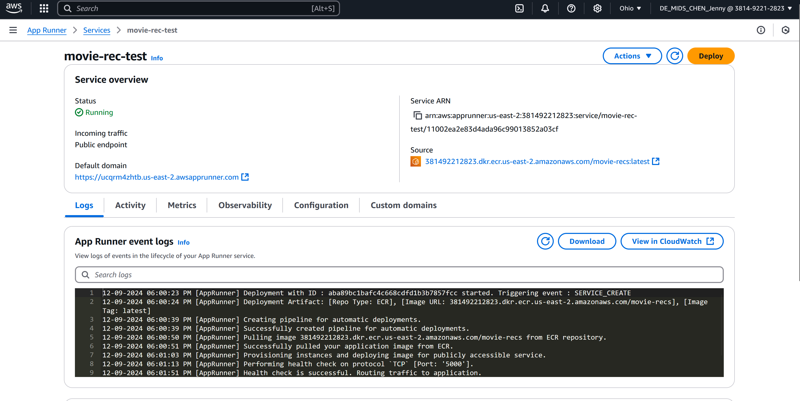
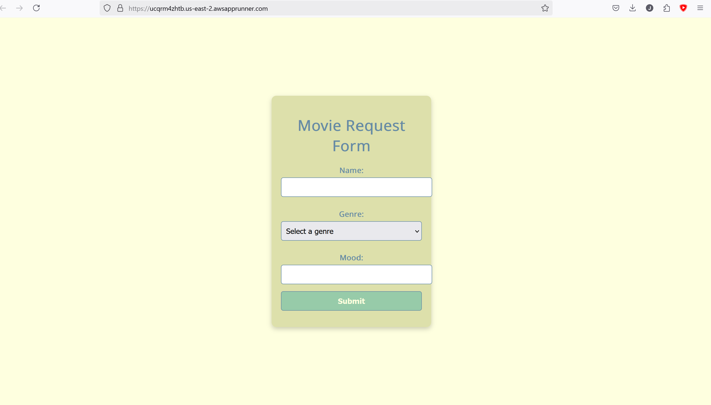
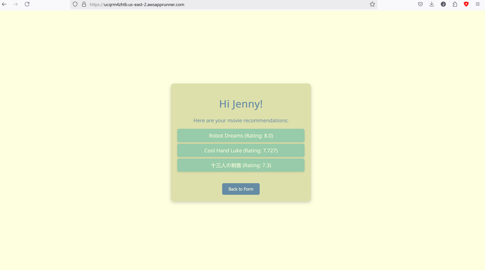
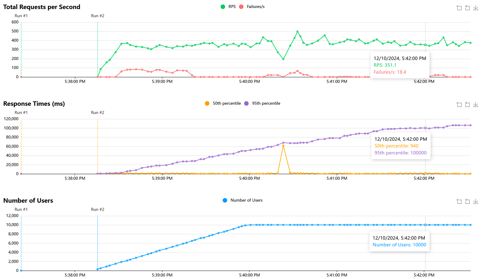

# MovieRecs_DataEngineering

Contributors: Atreya Tadepalli, Jahnavi Maddhuri, Jenny Chen, Fan Xu
[Movie Recommendations App](https://ucqrm4zhtb.us-east-2.awsapprunner.com/)

Youtube Demo: https://youtu.be/qCGuWaeAqQg

In this project we developed a movie recommendations application. The frontend was built on Flask and backend developed on Python. Our data was hosted on Databricks with the application containerized on Docker and deployed with AWS ECR and AppRunner. We then performed load testing using Locust. Our CI/CD is located within GitHub Actions.

## CICD Badges:
[](https://github.com/jahnavi-maddhuri/MovieRecs_DataEngineering/actions/workflows/IaC.yml) \
[](https://github.com/jahnavi-maddhuri/MovieRecs_DataEngineering/actions/workflows/install.yml) \
[](https://github.com/jahnavi-maddhuri/MovieRecs_DataEngineering/actions/workflows/lint.yml) \
[](https://github.com/jahnavi-maddhuri/MovieRecs_DataEngineering/actions/workflows/format.yml) \
[](https://github.com/jahnavi-maddhuri/MovieRecs_DataEngineering/actions/workflows/test.yml)

## Architechitural Diagram



## Environment
* requirements.txt 
* Dockerfile to set up Flask app and Docker 
* Makefile - to build the Docker image, run it, and push to Docker Hub
* github actions - yml file with Github secrets for Docker Hub in order to automate the build and run when pushed to Github

## Preparation and Running
1. Open codespaces 
2. Load repo to code spaces
3. Run `make build` to build the Docker image
4. Run `make run` to run the app
5. Run `make push` to push the image to Docker Hub

## Data Source



For this project we used TMDB, or The Movie Database which has data on movies and TV shows collected by community users. We used their API functionality and made calls using the following syntax:

```
import requests

url = <api url>

headers = {
    "accept": "application/json",
    "Authorization": <authorization token>
}

response = requests.get(url, headers=headers)

print(response.text)
```
Data that we collected included genres, movie descriptions, ratings and popularity

## Workflow
1. Data extracted from TMDB and loaded as a table into Databricks



2. Create Docker image and container to host Flask app locally, which takes in user input for genre of movie interest and current mood

3. Call on Databricks table and query using SQL filtering by genre, mood, and top ratings to output 3 movie recommendations 

4. Push Docker image to AWS ECR (Elastic Container Registry) for cloud hosted image



5. Deploy Flask app on AWS App Runner sourcing through image in ECR



6. When local Flask app and Docker image is updated, automatic updates to ECR container and image using CI/CD 

7. AppRunner is deployed automatically and ECR updates are automatically reflected in AppRunner web app





## Load Testing
10000 Users and up to 497 requests per second. We were unable to reach 10000 requests per second (RPS) likely because we are on a lower tier cloud service. A higher tier would likely boost our RPS to a higher amount.


